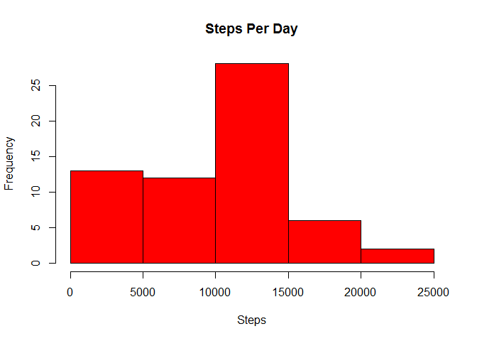
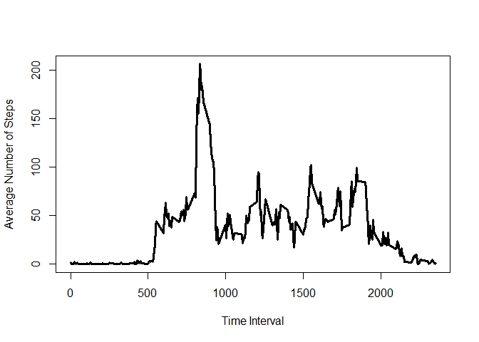
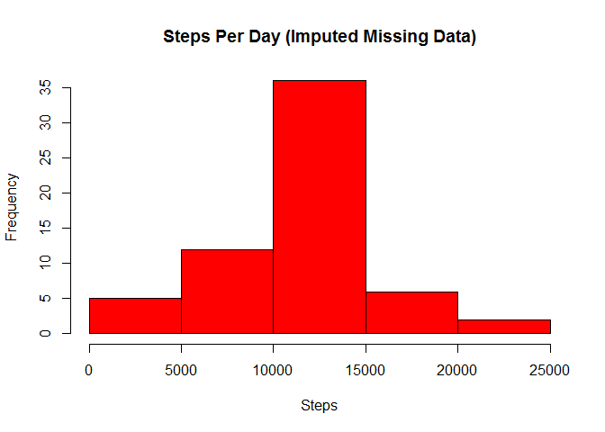

# Reproducible Research: Peer Assessment 1


## Loading and preprocessing the data


```r
setwd("R:/RepData_PeerAssessment1")
activity <- read.csv(unz("activity.zip", "activity.csv"),stringsAsFactors=FALSE)
# Get sum of steps by day
sum_steps_by_day<-aggregate(activity[,1],list(Date=activity$date),sum,na.rm=TRUE)
colnames(sum_steps_by_day)[2] <- "Total_Steps"
# Get mean of steps by day
mean_steps_by_day<-aggregate(activity[,1],list(Date=activity$date),mean,na.rm=TRUE)
colnames(mean_steps_by_day)[2] <- "Mean_Steps"
# Get median of steps by day
median_steps_by_day<-aggregate(activity[,1],list(Date=activity$date),median,na.rm=TRUE)
colnames(median_steps_by_day)[2] <- "Median_Steps"
# Get mean of steps by 5-minute interval
mean_steps_by_interval<-aggregate(activity[,1],list(Interval=activity$interval),mean,na.rm=TRUE)
colnames(mean_steps_by_interval)[2] <- "Mean_Steps"
```

## What is mean total number of steps taken per day?


```r
# Generate histogram of steps by day
hist(sum_steps_by_day$Total_Steps,main="Steps Per Day",xlab="Steps",col="Red")
```

 

```r
# Mean by day for steps
mean_steps_by_day
```

```
##          Date Mean_Steps
## 1  2012-10-01        NaN
## 2  2012-10-02  0.4375000
## 3  2012-10-03 39.4166667
## 4  2012-10-04 42.0694444
## 5  2012-10-05 46.1597222
## 6  2012-10-06 53.5416667
## 7  2012-10-07 38.2465278
## 8  2012-10-08        NaN
## 9  2012-10-09 44.4826389
## 10 2012-10-10 34.3750000
## 11 2012-10-11 35.7777778
## 12 2012-10-12 60.3541667
## 13 2012-10-13 43.1458333
## 14 2012-10-14 52.4236111
## 15 2012-10-15 35.2048611
## 16 2012-10-16 52.3750000
## 17 2012-10-17 46.7083333
## 18 2012-10-18 34.9166667
## 19 2012-10-19 41.0729167
## 20 2012-10-20 36.0937500
## 21 2012-10-21 30.6284722
## 22 2012-10-22 46.7361111
## 23 2012-10-23 30.9652778
## 24 2012-10-24 29.0104167
## 25 2012-10-25  8.6527778
## 26 2012-10-26 23.5347222
## 27 2012-10-27 35.1354167
## 28 2012-10-28 39.7847222
## 29 2012-10-29 17.4236111
## 30 2012-10-30 34.0937500
## 31 2012-10-31 53.5208333
## 32 2012-11-01        NaN
## 33 2012-11-02 36.8055556
## 34 2012-11-03 36.7048611
## 35 2012-11-04        NaN
## 36 2012-11-05 36.2465278
## 37 2012-11-06 28.9375000
## 38 2012-11-07 44.7326389
## 39 2012-11-08 11.1770833
## 40 2012-11-09        NaN
## 41 2012-11-10        NaN
## 42 2012-11-11 43.7777778
## 43 2012-11-12 37.3784722
## 44 2012-11-13 25.4722222
## 45 2012-11-14        NaN
## 46 2012-11-15  0.1423611
## 47 2012-11-16 18.8923611
## 48 2012-11-17 49.7881944
## 49 2012-11-18 52.4652778
## 50 2012-11-19 30.6979167
## 51 2012-11-20 15.5277778
## 52 2012-11-21 44.3993056
## 53 2012-11-22 70.9270833
## 54 2012-11-23 73.5902778
## 55 2012-11-24 50.2708333
## 56 2012-11-25 41.0902778
## 57 2012-11-26 38.7569444
## 58 2012-11-27 47.3819444
## 59 2012-11-28 35.3576389
## 60 2012-11-29 24.4687500
## 61 2012-11-30        NaN
```

```r
# Median by day for steps
median_steps_by_day
```

```
##          Date Median_Steps
## 1  2012-10-01           NA
## 2  2012-10-02            0
## 3  2012-10-03            0
## 4  2012-10-04            0
## 5  2012-10-05            0
## 6  2012-10-06            0
## 7  2012-10-07            0
## 8  2012-10-08           NA
## 9  2012-10-09            0
## 10 2012-10-10            0
## 11 2012-10-11            0
## 12 2012-10-12            0
## 13 2012-10-13            0
## 14 2012-10-14            0
## 15 2012-10-15            0
## 16 2012-10-16            0
## 17 2012-10-17            0
## 18 2012-10-18            0
## 19 2012-10-19            0
## 20 2012-10-20            0
## 21 2012-10-21            0
## 22 2012-10-22            0
## 23 2012-10-23            0
## 24 2012-10-24            0
## 25 2012-10-25            0
## 26 2012-10-26            0
## 27 2012-10-27            0
## 28 2012-10-28            0
## 29 2012-10-29            0
## 30 2012-10-30            0
## 31 2012-10-31            0
## 32 2012-11-01           NA
## 33 2012-11-02            0
## 34 2012-11-03            0
## 35 2012-11-04           NA
## 36 2012-11-05            0
## 37 2012-11-06            0
## 38 2012-11-07            0
## 39 2012-11-08            0
## 40 2012-11-09           NA
## 41 2012-11-10           NA
## 42 2012-11-11            0
## 43 2012-11-12            0
## 44 2012-11-13            0
## 45 2012-11-14           NA
## 46 2012-11-15            0
## 47 2012-11-16            0
## 48 2012-11-17            0
## 49 2012-11-18            0
## 50 2012-11-19            0
## 51 2012-11-20            0
## 52 2012-11-21            0
## 53 2012-11-22            0
## 54 2012-11-23            0
## 55 2012-11-24            0
## 56 2012-11-25            0
## 57 2012-11-26            0
## 58 2012-11-27            0
## 59 2012-11-28            0
## 60 2012-11-29            0
## 61 2012-11-30           NA
```


## What is the average daily activity pattern?


```r
# Show average number of steps by time interval on a time series chart
plot(mean_steps_by_interval$Interval, mean_steps_by_interval$Mean_Steps, type="l", xlab= "Time Interval", ylab= "Average Number of Steps", col="black" , lwd=3)
```

 

```r
# Which interval has the greatest average number of steps?
subset(mean_steps_by_interval, Mean_Steps == max(mean_steps_by_interval$Mean_Steps))
```

```
##     Interval Mean_Steps
## 104      835   206.1698
```

## Imputing missing values

For the missing values, use the mean value for the time interval (across all days)
as a proxy for the missing value.


```r
# Count the number of rows, dates/intervals, that have missing step count
sum(is.na(activity$steps))
```

```
## [1] 2304
```

```r
# Replace NA values with the average for that time interval
activity2 <- activity
activity2$interval_step_mean <- mean_steps_by_interval$Mean_Steps[match(activity2$interval,mean_steps_by_interval$Interval)]
activity2$steps[is.na(activity2$steps)] <- activity2$interval_step_mean[is.na(activity2$steps)]

# Get sum of steps by day
sum_steps_by_day2<-aggregate(activity2[,1],list(Date=activity2$date),sum,na.rm=TRUE)
colnames(sum_steps_by_day2)[2] <- "Total_Steps"
# Get mean of steps by day
mean_steps_by_day2<-aggregate(activity2[,1],list(Date=activity2$date),mean,na.rm=TRUE)
colnames(mean_steps_by_day2)[2] <- "Mean_Steps"
# Get median of steps by day
median_steps_by_day2<-aggregate(activity2[,1],list(Date=activity2$date),median,na.rm=TRUE)
colnames(median_steps_by_day2)[2] <- "Median_Steps"
# Get mean of steps by 5-minute interval
mean_steps_by_interval2<-aggregate(activity2[,1],list(Interval=activity2$interval),mean,na.rm=TRUE)
colnames(mean_steps_by_interval2)[2] <- "Mean_Steps"
# Generate histogram of steps by day
hist(sum_steps_by_day2$Total_Steps,main="Steps Per Day (Imputed Missing Data)",xlab="Steps",col="Red")
```

 

```r
# Mean by day for steps
mean_steps_by_day2
```

```
##          Date Mean_Steps
## 1  2012-10-01 37.3825996
## 2  2012-10-02  0.4375000
## 3  2012-10-03 39.4166667
## 4  2012-10-04 42.0694444
## 5  2012-10-05 46.1597222
## 6  2012-10-06 53.5416667
## 7  2012-10-07 38.2465278
## 8  2012-10-08 37.3825996
## 9  2012-10-09 44.4826389
## 10 2012-10-10 34.3750000
## 11 2012-10-11 35.7777778
## 12 2012-10-12 60.3541667
## 13 2012-10-13 43.1458333
## 14 2012-10-14 52.4236111
## 15 2012-10-15 35.2048611
## 16 2012-10-16 52.3750000
## 17 2012-10-17 46.7083333
## 18 2012-10-18 34.9166667
## 19 2012-10-19 41.0729167
## 20 2012-10-20 36.0937500
## 21 2012-10-21 30.6284722
## 22 2012-10-22 46.7361111
## 23 2012-10-23 30.9652778
## 24 2012-10-24 29.0104167
## 25 2012-10-25  8.6527778
## 26 2012-10-26 23.5347222
## 27 2012-10-27 35.1354167
## 28 2012-10-28 39.7847222
## 29 2012-10-29 17.4236111
## 30 2012-10-30 34.0937500
## 31 2012-10-31 53.5208333
## 32 2012-11-01 37.3825996
## 33 2012-11-02 36.8055556
## 34 2012-11-03 36.7048611
## 35 2012-11-04 37.3825996
## 36 2012-11-05 36.2465278
## 37 2012-11-06 28.9375000
## 38 2012-11-07 44.7326389
## 39 2012-11-08 11.1770833
## 40 2012-11-09 37.3825996
## 41 2012-11-10 37.3825996
## 42 2012-11-11 43.7777778
## 43 2012-11-12 37.3784722
## 44 2012-11-13 25.4722222
## 45 2012-11-14 37.3825996
## 46 2012-11-15  0.1423611
## 47 2012-11-16 18.8923611
## 48 2012-11-17 49.7881944
## 49 2012-11-18 52.4652778
## 50 2012-11-19 30.6979167
## 51 2012-11-20 15.5277778
## 52 2012-11-21 44.3993056
## 53 2012-11-22 70.9270833
## 54 2012-11-23 73.5902778
## 55 2012-11-24 50.2708333
## 56 2012-11-25 41.0902778
## 57 2012-11-26 38.7569444
## 58 2012-11-27 47.3819444
## 59 2012-11-28 35.3576389
## 60 2012-11-29 24.4687500
## 61 2012-11-30 37.3825996
```

```r
# Median by day for steps
median_steps_by_day2
```

```
##          Date Median_Steps
## 1  2012-10-01     34.11321
## 2  2012-10-02      0.00000
## 3  2012-10-03      0.00000
## 4  2012-10-04      0.00000
## 5  2012-10-05      0.00000
## 6  2012-10-06      0.00000
## 7  2012-10-07      0.00000
## 8  2012-10-08     34.11321
## 9  2012-10-09      0.00000
## 10 2012-10-10      0.00000
## 11 2012-10-11      0.00000
## 12 2012-10-12      0.00000
## 13 2012-10-13      0.00000
## 14 2012-10-14      0.00000
## 15 2012-10-15      0.00000
## 16 2012-10-16      0.00000
## 17 2012-10-17      0.00000
## 18 2012-10-18      0.00000
## 19 2012-10-19      0.00000
## 20 2012-10-20      0.00000
## 21 2012-10-21      0.00000
## 22 2012-10-22      0.00000
## 23 2012-10-23      0.00000
## 24 2012-10-24      0.00000
## 25 2012-10-25      0.00000
## 26 2012-10-26      0.00000
## 27 2012-10-27      0.00000
## 28 2012-10-28      0.00000
## 29 2012-10-29      0.00000
## 30 2012-10-30      0.00000
## 31 2012-10-31      0.00000
## 32 2012-11-01     34.11321
## 33 2012-11-02      0.00000
## 34 2012-11-03      0.00000
## 35 2012-11-04     34.11321
## 36 2012-11-05      0.00000
## 37 2012-11-06      0.00000
## 38 2012-11-07      0.00000
## 39 2012-11-08      0.00000
## 40 2012-11-09     34.11321
## 41 2012-11-10     34.11321
## 42 2012-11-11      0.00000
## 43 2012-11-12      0.00000
## 44 2012-11-13      0.00000
## 45 2012-11-14     34.11321
## 46 2012-11-15      0.00000
## 47 2012-11-16      0.00000
## 48 2012-11-17      0.00000
## 49 2012-11-18      0.00000
## 50 2012-11-19      0.00000
## 51 2012-11-20      0.00000
## 52 2012-11-21      0.00000
## 53 2012-11-22      0.00000
## 54 2012-11-23      0.00000
## 55 2012-11-24      0.00000
## 56 2012-11-25      0.00000
## 57 2012-11-26      0.00000
## 58 2012-11-27      0.00000
## 59 2012-11-28      0.00000
## 60 2012-11-29      0.00000
## 61 2012-11-30     34.11321
```


## Are there differences in activity patterns between weekdays and weekends?

Create a new factor variable, wkday_end to designate Weekday or Weekend.
Saturday and Sunday are used for weekend days.

Compare average steps by interval weekend days vs. weekday days.


```r
activity2$wkday_end[weekdays(as.Date(activity2$date))=="Saturday" | weekdays(as.Date(activity2$date))=="Sunday"] <- "Weekend"

activity2$wkday_end[weekdays(as.Date(activity2$date))!="Saturday" & weekdays(as.Date(activity2$date))!="Sunday"] <- "Weekday"

mean_steps_by_interval_wkday_end<-aggregate(activity2[,1][activity2$wkday_end=="Weekday"],
                                     list(Interval=activity2$interval[activity2$wkday_end=="Weekday"]),
                                     mean,na.rm=TRUE)
colnames(mean_steps_by_interval_wkday_end)[2] <- "weekday"
mean_steps_by_interval2_we<-aggregate(activity2[,1][activity2$wkday_end=="Weekend"],
                                      list(Interval=activity2$interval[activity2$wkday_end=="Weekend"]),
                                      mean,na.rm=TRUE)

mean_steps_by_interval_wkday_end$weekend <- 
     mean_steps_by_interval2_we$x[match(mean_steps_by_interval_wkday_end$Interval,mean_steps_by_interval2_we$Interval)]

library(lattice)

xyplot(weekday + weekend ~ Interval, 
       data = mean_steps_by_interval_wkday_end, 
       layout = c(1,2), 
       type = "l", 
       ylab="Number of Steps",
       outer = TRUE)
```

 
